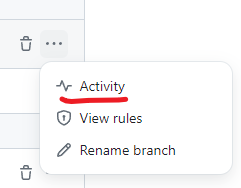
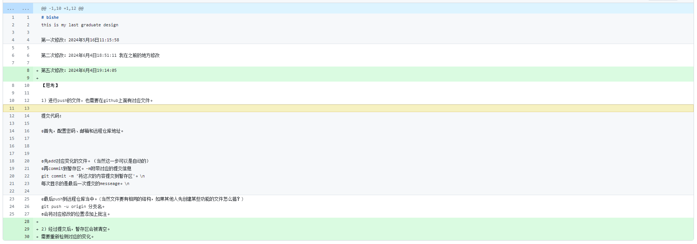

# bishe
this is my last graduate design

第一次修改：2024年5月16日11:15:58

第二次修改：2024年6月4日18:51:11 我在之前的地方修改

第五次修改：2024年6月4日19:14:05

【思考】

1）进行push的文件，也需要在github上面有对应文件。

提交代码：

①首先，配置密码、邮箱和远程仓库地址。

②先add对应变化的文件。（当然这一步可以是自动的）
③再commit到暂存区。-m附带对应的提交信息
git commit -m '将这次的内容提交到暂存区'。\n
每次显示的是最后一次提交的messeage。\n

④最后push到远程仓库当中。(当然文件要有相同的结构，如果其他人先创建某些功能的文件怎么搞？)
git push -u origin 分支名。
⑤会将对应修改的位置添加上批注。

2）经过提交后，暂存区会被清空。
需要重新检测对应的变化。通过git add .

3）先前的内容被误删或覆盖了，都可以在该分支下查看对应提交的信息。
通过xx进行回溯

4）如何展示现在的网页。

5）分支分为默认分支和自己建的其他分支。

6）如何查看自己对于这些编程的活动。

点击Activity可以看到自己和其他人的操作记录。

绿色部分，就是本次提交的新增的东西。
